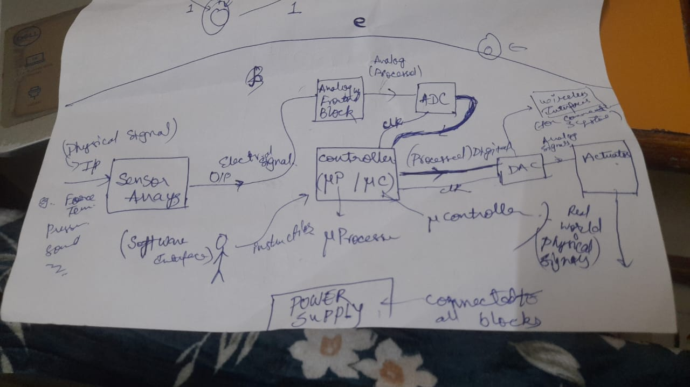

# Module 1: Introduction to analogue circuits

<!--toc:start-->
- [Module 1: Introduction to analogue circuits](#module-1-introduction-to-analogue-circuits)
  - [Electronic Systems](#electronic-systems)
    - [Differences between embedded systems  and general purpose systems](#differences-between-embedded-systems-and-general-purpose-systems)
  - [Abstraction Levels](#abstraction-levels)
  - [End to End block diagrams](#end-to-end-block-diagrams)
<!--toc:end-->

## Electronic Systems
### Differences between embedded systems  and general purpose systems
|  | General Purpose Systems | Embedded Systems |  
| - | - | - |
|Functionality| multitaksing | application specific|
|Control Unit| microprocessor | microcontroller|
|Form Factor| not much limited | very small|
|Power Consumption| continuous supply adaptors chargers etc. | works even with smaller batteries and other alternatives (eg. solar cells etc.)|
|Memory| larger RAM Sizes | smaller RAM sizes|
|Cost| higher costs (except can be optimized for mass production) | much cheaper|

## Abstraction Levels
1) Materials level
2) Devices Level 
3) Circuits
4) Systems level
5) Product level <!-- difference being that products need certification -->

## End to End block diagrams
 
 
 

- Electronic systems generally process real world information, where the current or voltage  is taken as a representation of information present in the real world signals
- Every electronic systems' interface to the real world through transducers for the purpose of converting information from one domain to the other.
- Examples:
  - Sensors
    - Force sensors
    - ...
  - Actuators
    - haptics
    - speakers
- The central control blocks present in electronic systems is either an microprocessor or microcontroller
- Microprocessor are frequently used in general purpose systems
- Microcontrollers in embedded systems
- additional hardware counterparts used along with controllers like
  - FPGA
    - Field Programmable Gate Arrays
  - PLD
    - Programmable Logic Devices
  - GPU
    - Graphical Processing Units
- Every processor or controller is a digital entity that can understand information only in the machine language
  - for this very purpose, every processor enables a programmer to write instructions to hardware in terms of high level languages, where the instructions are converted from high Level languages to machine level languages through compilers assemblers etc.
- The conversion b/w analog to digital  and vice versa are generally done by ADCs and DACs
- Electronic Systems may contain discrete ADCs and DACs
- In some cases such circuits can be integrated as part of the processor also
- In wireless communication systems, we have additional hardware blocks so as to send and receive signals in the RF range and the microwave range, e.g.
  - antennas
  - transmission lines
  - wave gates
  - transceivers
- E.g. <!-- 16/01/2025 -->
  - Digital Weighing machine
    -  
  - 2D obstacle avoiding robots
    -  
## Introduction to VLSI and Integrated Circuits
  - Motivations
    - size reduction (miniaturization)
    - low power implementation
    - computational complexity
    - Cost
      - reduced with semiconductor fabrication technology
    - Operating frequency bandwidth
