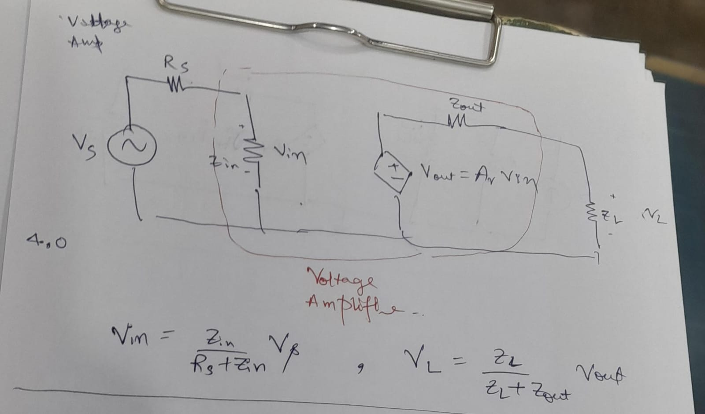
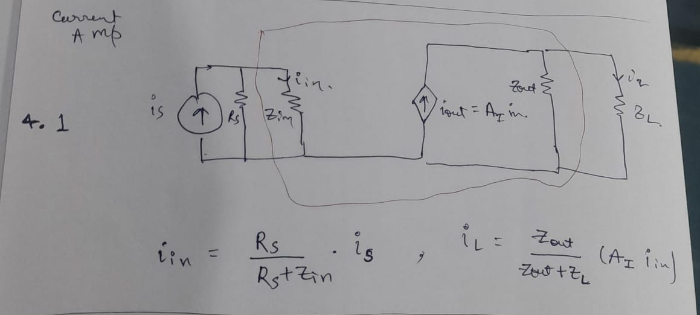
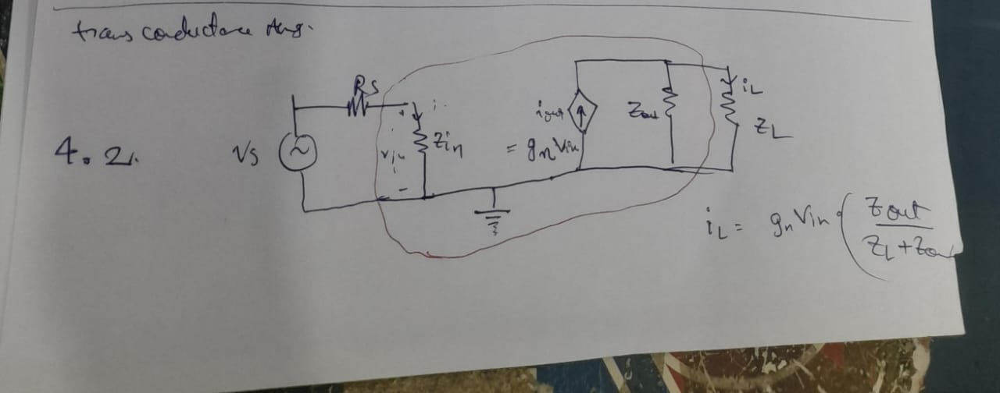
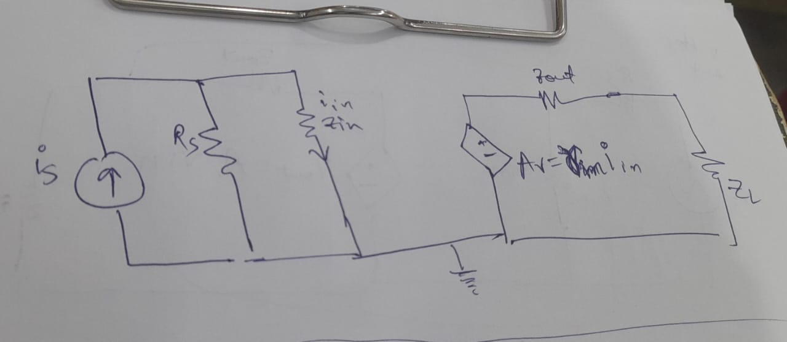

# BJT AC amplifier analysis

## classification of amplifiers

- Volatge           Amplifiers
  - $A_v = \frac{v_{out}}{v_{in}}$
  -  
  - e.g. Audio amplifiers
- Current           Amplifiers
  - $A_i = \frac{i_{ out }}{i_{in}}$
  - 
  - e.g. BJT
- Trans-Conductance Amplifiers
  - $A_g = \frac{i_{out}}{v_{in}}$
  - 
  - e.g. MOSFET
- Trans-Resistance  Amplifiers
  - $A_r = \frac{v_{out}}{i_{in}}$
  -  

...

## 

| Amplifier config            | TxF Function    | Z_in_real  | Z_in_ideal   | Z_out_real   | z_out_ideal   |
| ----------------            | --------------  | ---------- | ------------ | ------------ | ------------- |
| Voltage Amplifier           | Av = v_out/v_in | >> Rs      | inf          | << zl        | 0             |
| Current Amplifier           | Ai = i_out/i_in | << R_s     | 0            | >> Zl        | inf           |
| trans-conductance Amplifier | gm = i_out/v_in | >> R_s     | inf          | >> Zl        | inf           |
| trans-resistance Amplifier  | rm = v_out/i_in | << R_s     | 0            | << Zl        | 0             |

## AC Analysis - modelling of transistors

It is important to note that amplifier design is a subjective process where the bias circuit design not only impacts the Q point of operation, but also determines several parameters w.r.t AC mode of operation as well.

With regards to AC analysis of transistor based amplifier ckts, we generally consider the following types of transistor models for mathematical analysis

- Large Signal Model
- Small Signal Model
- Low Frequency Model
- High Frequency Model

Large Signal model takes care of the non linear response of the transistor, by considering current and voltage swing across the full range for a given bias supply (rail to rail).

On the other hand, small signal models of a transistor generally do not consider such a large voltage swing across the characteristics. In such small signal models, we make an assumption that under AC mode of operation, the AC signal shall shift the Q point only around a small infinitesimal region around the Q point in input characteristics (this )

$r_e$ model for BJTs is frequently used with regards to small signal low frequency operation.
We also have models like hybrid pipe model that model the transistor for small signal high freq operation. In addition to this, transistors can also be modelled using conventional two port network analysis .e.g. H parameter model of the BJT

### small signal - quantitative analysis

| representation | meaning |
|-|-|
|$I_B$ | purely DC |
|$i_b$ | purely AC |
|$i_B$ | DC + AC   |

$i_B = i_{B_0} \exp\left[\frac{V_{BE}}{\eta V_{T}}\right]$

$v_{BE} = V_{BE} + v_{bc}$
AC+DC = purelyDC (Q point) + purely AC

$i_B \approx I_{BQ} \exp\left[\frac{v_{be}}{\eta V_{T}}\right]$

by taylor series approximation for $v_{be} \ll \eta V_T$

$i_B \approx I_{BQ} \left[1+\frac{v_{be}}{\eta V_{T}}\right]$

### $r_e$ model for the transistor

fig 4.4
